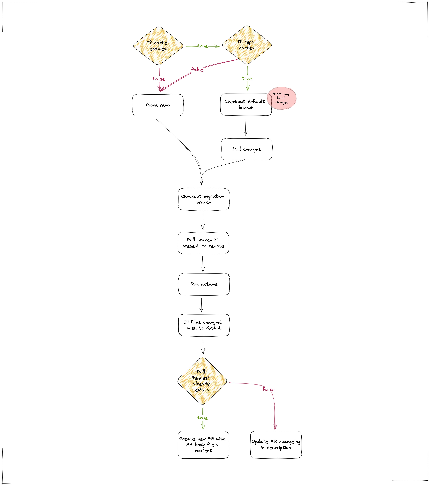

**Table of contents:**

<!-- TOC -->

- [Overview](#overview)
- [Actions](#actions)
    - [Find and replace](#find-and-replace)
    - [Run commands](#run-commands)

<!-- /TOC -->

# Overview

Every migration performs a set of actions on the repo. Actions do things like find and replace text, or run a premade command/script. If the action changed anything, we push the changes to a branch and cut a new Pull Request on GitHub to propose the changes to codeowners.

Migrations should be treated as idempotent, so that you can run the same migration several times but only have exact same changes made each time. 

Below is high level flow diagram of how a migration works.



# Actions

The description is the content of the commit message with the changes made.

Any field with a default of `-` is a required field.

## Find and replace

|  Key 	| Description                                         	| Default 	|
|-----:	|-----------------------------------------------------	|---------	|
|  old 	| Old string to be replaced                           	| –       	|
|  new 	| New string to replace it with                       	| –       	|
| glob 	| The glob pattern for file matching the replacements 	| "**"    	|


```yaml
- action: replace
  description: "This is an example of a replacement"
  input:
    old: example string to replace
    new: this string is going to be better
    glob: "**"
```

## Run commands 

|     Key 	| Description                                                                                     	| Default 	|
|--------:	|-------------------------------------------------------------------------------------------------	|---------	|
| command 	| The command to be run. This command is passed to a bash shell, so it should be bash compatible. 	| –       	|

```yaml
- action: run_command
  description: "Example command run"
  input: 
    command: "echo 'Test' > test.txt"
```
