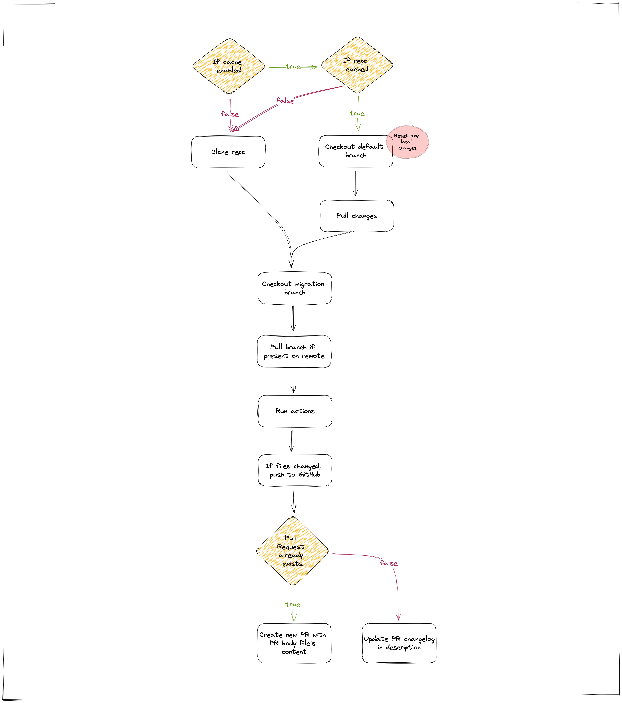

**Table of contents:**

<!-- TOC -->

- [Overview](#overview)
- [Dry-run mode](#dry-run-mode)
- [Actions](#actions)
  - [Add file](#add-file)
  - [Find and replace](#find-and-replace)
  - [Run commands](#run-commands)
  - [YAML](#yaml)
  - [JSON](#json)

<!-- /TOC -->

# Overview


Every migration performs a set of actions on the repo. Actions do things like find and replace text, or run a premade command/script. If the action changed anything, we push the changes to a branch and cut a new Pull Request on GitHub to propose the changes to codeowners.

Migrations should be treated as idempotent, so that you can run the same migration several times but only have exact same changes made each time. 

Below is high level flow diagram of how a migration works.



# Dry-run mode

Pass `--dry-run` (short: `-d`) to the `migrate` command to preview what would happen without making any permanent changes:

```
banshee migrate --dry-run migration.yaml
banshee migrate -d migration.yaml
```

In dry-run mode Banshee:
- Clones every target repo and applies all actions exactly as normal
- Logs `[dry-run] Would commit: <description>` for each action that produced changes, instead of creating a commit
- Logs `[dry-run] Would push branch and open/update PR for <repo>` instead of pushing or touching GitHub
- Does **not** update the progress file, so re-running without `--dry-run` will process the full repo list again

Dry-run is safe to use in CI to audit what a migration would change before merging the migration config.

# Actions

The description is the content of the commit message with the changes made.

Any field with a default of `-` is a required field.

## Add file

Creates a new file with the specified content.

|      Key | Description                   | Default |
| -------: | ----------------------------- | ------- |
|     file | Path and filename to create   | –       |
|  content | Content of the new file       | –       |

```yaml
- action: add_file
  description: "Add new configuration file"
  input:
    file: ".gitignore"
    content: |
      node_modules/
      dist/
      .env
```

## Find and replace

|  Key | Description                                         | Default |
| ---: | --------------------------------------------------- | ------- |
|  old | Old string to be replaced                           | –       |
|  new | New string to replace it with                       | –       |
| glob | The glob pattern for file matching the replacements | "**"    |


```yaml
- action: replace
  description: "This is an example of a replacement"
  input:
    old: example string to replace
    new: this string is going to be better
    glob: "**"
```

## Run commands 

|     Key | Description                                                                                     | Default |
| ------: | ----------------------------------------------------------------------------------------------- | ------- |
| command | The command to be run. This command is passed to a bash shell, so it should be bash compatible. | –       |


The environment from the execution environment is forwarded to the run command. There are also some added helper variables:

|           Var | Description                               |
| ------------: | ----------------------------------------- |
| MIGRATION_DIR | The directory of the migration YAML file. |

```yaml
- action: run_command
  description: "Example command run"
  input: 
    command: "echo 'Test' > test.txt"
```

## YAML

A helper for making YAML file changes.

|        Key | Description                                                         | Default |
| ---------: | ------------------------------------------------------------------- | ------- |
|       glob | The glob pattern for file matching the replacements                 | –       |
|   yamlpath | A dot notation path to the key being updated/added/deleted          | –       |
| sub_action | The YAML action being performed (replace, add, delete, list_append) | –       |
|      value | The value to be added                                               | –       |

```yaml
- action: yaml
  description: "Change a YAML file"
  input: 
    glob: "example.yaml"
    sub_action: replace
    yamlpath: "firstlevel.secondlevel"
    value: "new value"
- action: yaml
  description: "Change a YAML file"
  input: 
    glob: "example.yaml"
    sub_action: add
    yamlpath: "firstlevel.secondlevel"
    value: "new value"
- action: yaml
  description: "Change a YAML file"
  input: 
    glob: "example.yaml"
    sub_action: delete
    yamlpath: "firstlevel.secondlevel"
- action: yaml
  description: "Change a YAML file"
  input:
    glob: "example.yaml"
    sub_action: list_append
    yamlpath: "firstlevel.secondlevel"
    value: "new item"
```

## JSON

A helper for making JSON file changes. Preserves key order and formatting using raw-byte manipulation.

|        Key | Description                                                          | Default        |
| ---------: | -------------------------------------------------------------------- | -------------- |
|       glob | The glob pattern for file matching                                   | `**/*.json`    |
|   jsonpath | A dot-notation path to the key being updated/added/deleted           | –              |
| sub_action | The action to perform (`replace`, `add`, `delete`, `list_append`)   | –              |
|      value | The value to set (omit for `delete`)                                 | –              |

`list_append` requires the target path to already exist and be an array; it logs an error and skips the file otherwise.

```yaml
- action: json
  description: "Bump package version"
  input:
    glob: "package.json"
    sub_action: replace
    jsonpath: "version"
    value: "2.0.0"
- action: json
  description: "Add homepage field"
  input:
    glob: "package.json"
    sub_action: add
    jsonpath: "homepage"
    value: "https://example.com"
- action: json
  description: "Remove deprecated field"
  input:
    glob: "**/*.json"
    sub_action: delete
    jsonpath: "scripts.prepublish"
- action: json
  description: "Add new lint script to all packages"
  input:
    glob: "**/package.json"
    sub_action: list_append
    jsonpath: "keywords"
    value: "oss"
```